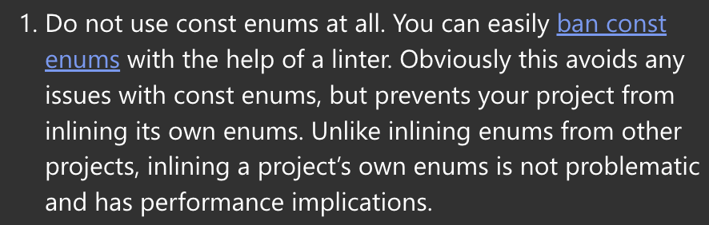

# 3장 : 타입의 모든 것

---

> 📌 타입스크립트에서 이용할 수 있는 타입과 각각의 타입으로 무엇을 할 수 있는지를 살펴봄

# 타입이란?

> **타입(type)**
> 값과 이 값으로 할 수 있는 일의 집합

- 타입 검사기를 이용하여 유효하지 않은 동작이 실행되는 일을 예방한다.
- 어떤 타입을 어떻게 사용하지는 통해 타입 확인자는 특정 동작이 유효한지 아닌지를 판단함

---

# 타입의 종류

[Documentation - Everyday Types](https://www.typescriptlang.org/docs/handbook/2/everyday-types.html)

- `Value: number` 와 같은 이노테이션의 경우 경계 개념으로 해석할 수도 있다.
  타입스크립트에 value의 상위 한정값이 number라고 알려주면,
  전달할 수 있는 모든 값은 number 이하여야 한다. (6장에서 할당, 한정, 제한 정의)
- 타입스크립트는 타입 사용을 위해 **기존 자바스크립트에서 사용하는 타입(string, number, boolean, object, class 등)**들과 함께 타입스크립트에서만의 **고유 특수 타입(any, unknown, void, never, Union, Intersection)**들을 제공한다.

## 1. any (중간 계층 타입)

- 모든 타입의 집합

  - 원시형 (이하 JS와 동일) : 하나의 값만 저장할 수 있는 기본적인 데이터 유형들
    - boolean
    - number
    - bigint
    - string
    - symbol
    - null / undefined
  - 참조형

    - object

      - **object**
      - Array : `[1, 2, 3]` == `number[]` == `Array<number>`
      - Tuple : Array 타입 + **길이 고정** + **각 인덱스의 타입 고정**
      - function

        - 선언 함수 : 입력(매개변수) 및 출력(반환) 타입 지정

          ```tsx
          // 매개변수 타입 표기
          function greet(name: string) {
            console.log('Hello, ' + name.toUpperCase() + '!!')
          }

          // 반환 타입 표기 -> 보통 return문에서 암묵적 타입 추론
          // ∴ 잘못된 수정을 미연에 방지하거나, 지극히 개인적인 선호에 의한 코드
          function getFavoriteNumber(): number {
            return 26 // 암묵적 타입 추론
          }
          ```

        - 익명 함수 : 암묵적 타입 추론

          ```tsx
          // 익명 함수에 대한 문맥적 타입 부여
          names.forEach(function (s) {
            console.log(s.toUppercase())
            // Property 'toUppercase' does not exist on type 'string'. Did you mean 'toUpperCase'?
          })

          // 화살표 함수에도 문맥적 타입 부여
          names.forEach((s) => {
            console.log(s.toUppercase())
            // Property 'toUppercase' does not exist on type 'string'. Did you mean 'toUpperCase'?
          })
          ```

- 타입 검사를 진행하지 않는 타입.
  즉, 정적 타입 검사가 비활성화되면서 타입스크립트의 장점이 무력화되므로 되도록 사용하지 않는 것을 권한다. 대안으로 `unknown`과 같은 명시적 타입(추론 x, 모든 변수/함수/객체)이나 최소한 구체적 타입(any보다 좁은 데이터 범위, ex. 리터럴 값, 유니언 등)들을 사용하는 것이 좋다.
- 런타임 오류 가능성이 높기에 안정성이 낮은 타입이다.

- 여기서 잠깐! 타입스크립트의 **엄격도** 설정

  - 어떻게?
    - `tsconfig.json`에 `“strict” : true` 추가하기
  - 설정 값

    - any라면 오류 발생 : `noImplicitAny` (any의 과도한 사용을 방지)
      
    - 엄격한 버전 : `strictNullChecks` (null / undefined 참조 방지)
      [[TypeScript] strictNullChecks과 Type Guards를 이용한 안전한 코드, kimhako](https://ohhako.github.io/kimhako/articles/2020-07/Angular-strictNullChecks-post-copy
      https://velog.io/@milkcoke/)

      [[Typescript] strictNullChecks 활성화 무적권 해라, milkcoke](Typescript-strictNullCheck-%EB%AC%B4%EC%A1%B0%EA%B1%B4-%ED%95%B4%EB%9D%BC-2%EB%B2%88%ED%95%B4%EB%9D%BC)

## 2. unknown (명시적 타입) (최상위 계층 타입)

- any처럼 모든 타입의 값을 허용하지만, 안전성을 강화하기 위해 사용할 때 제한이 있는 타입이다. any와 유사하지만 더 엄격한 동작을 통해 런타임 오류를 방지하게끔 한다.

- 언제?

  - 타입을 알 수 없는 값을 처리할 때 사용
    - 외부 API 호출이나 사용자 입력 등 그 값들의 타입을 알 수 없을 때 사용한다.
      ```jsx
      function handleInput(input: unknown) {
        if (typeof input === 'string') {
          console.log(input.toUpperCase())
        } else if (typeof input === 'number') {
          console.log(input.toFixed(2))
        }
      }
      ```
  - any를 대체하기 위해 사용
    - any대신 unknown을 사용함으로써 불필요한 오류를 방지하고, 명확한 타입 검사를 강제한다.

- 어떻게?
  - 타입 좁히기(Narrowing)을 사용하여 다른 타입으로 변경이 가능하다.
    - Narrowing: 코드 실행의 흐름에 맞춰 값의 타입을 더 구체적으로 좁히는 과정
      [Documentation - Narrowing](https://www.typescriptlang.org/docs/handbook/2/narrowing.html)
    ```jsx
    function handleInput(input: unknown) {
      if (typeof input === 'string') {
        console.log(input.toUpperCase()) // 문자열로 좁혀진 경우 처리
      } else if (typeof input === 'number') {
        console.log(input.toFixed(2)) // 숫자로 좁혀진 경우 처리
      }
    }
    ```

## 3. object (중간 계층 타입)

- 단순히 `object`를 사용하는 것보다 객체 리터럴, 인터페이스, 타입 별칭을 사용하여 구체적으로 객체의 구조를 정의하는 것이 코드 안정성과 가독성을 높이는 데에 좋다.
- 왜?

  - object 타입만을 선언해놓으면, 모든 참조형 타입들을 허용하게 된다.
    구체적인 속성이나 구조를 명시하지 않으면 오류가 발생할 가능성이 높다.

    ```jsx
    let obj: object

    // 원시값은 할당 불가
    obj = 42 // Error
    obj = 'hello' // Error

    // 참조형 할당 가능
    obj = { name: 'John', age: 30 } // OK
    obj = [1, 2, 3] // OK
    obj = new Date() // OK

    // 속성 접근 시 오류 발생
    console.log(obj.name) // Error: 'name' 속성이 'object' 타입에 존재하지 않음
    ```

- 어떻게?

  - 해당 객체의 각 프로퍼티 타입 표기
    ```tsx
    // 프로퍼티 x와 y는 둘 다 number 타입 (프로퍼티는 구분은 , 또는 ;)
    function printCoord(pt: { x: number; y: number }) {
      console.log("The coordinate's x value is " + pt.x)
      console.log("The coordinate's y value is " + pt.y)
    }
    printCoord({ x: 3, y: 7 })
    ```
  - 옵셔널 프로퍼티 (단, 해당 프로퍼티 값을 사용할 때 undefined 여부를 확인해야 함)

    ```tsx
    function printName(obj: { first: string; last?: string }) {
      // ...
    }
    // 둘 다 OK
    printName({ first: 'Bob' })
    printName({ first: 'Alice', last: 'Alisson' })

    // 단, undefined 여부 확인
    function printName(obj: { first: string; last?: string }) {
      // 오류 - `obj.last`의 값이 없다면?
      console.log(obj.last.toUpperCase()) // 'obj.last' is possibly 'undefined'.

      // undefined인지 확인해야 한다.
      if (obj.last !== undefined) {
        console.log(obj.last.toUpperCase())
      }

      console.log(obj.last?.toUpperCase()) // 혹은 최신 JS 문법 사용하기 -> 옵셔널 체이닝
    }
    ```

<br><br>

> 4. 타입을 사용하는 타입, 기능들

---

## 4-1. Type Alias(+ interface) (중간 계층 타입)

- Type Alias(타입 별칭) : 타입을 위한 **이름**. 똑같은 타입을 재사용하거나 별명으로 부를 때 사용

  ```tsx
  type **Point** = {
    x: number;
    y: number;
  };


  function printCoord(pt: **Point**) {
    console.log("The coordinate's x value is " + pt.x);
    console.log("The coordinate's y value is " + pt.y);
  }

  printCoord({ x: 100, y: 100 });
  ```

  ```tsx
  // 유니언 타입에 타입 별칭 부여하기
  type ID = number | string
  ```

- 인터페이스 : 객체 타입을 만드는 방법

  - 예측된 프로퍼티를 가졌는지 그 구조에 중점인 방법
  - 오직 객체의 모양을 선언하는 데에만 사용된다.

  ```tsx
  **interface** **Point** {
    x: number;
    y: number;
  }

  // pt가 interface Point의 구조를 잘 지켰는지
  function printCoord(pt: **Point**) {
    console.log("The coordinate's x value is " + pt.x);
    console.log("The coordinate's y value is " + pt.y);
  }

  printCoord({ x: 100, y: 100 });
  ```

- 타입 별칭 vs 인터페이스

  - 대부분 유사하지만, **타입 별칭**은 새 프로퍼티를 추가하지 못하는 데 비해 **인터페이스**는 확장 가능하다

    ```tsx
    // 타입 별칭 : 새 프로퍼티를 확장하거나 수정할 수 없음
    // 확장 불가능 : 교집합을 통해서만 가능하다.
    type Animal = {
      name: string
    }

    type Bear = Animal & {
      honey: Boolean
    }

    const bear = getBear()
    bear.name
    bear.honey

    // 수정 불가능
    type Window = {
      title: string
    }

    type Window = {
      ts: TypeScriptAPI
    }

    // Error: Duplicate identifier 'Window'.
    ```

    ```tsx
    // 인터페이스 : 새 프로퍼티를 확장하거나 수정할 수 있다.
    // 확장 가능
    interface Animal {
      name: string
    }

    interface Bear extends Animal {
      honey: boolean
    }

    const bear = getBear()
    bear.name
    bear.honey

    // 수정 가능
    interface Window {
      title: string
    }

    interface Window {
      ts: TypeScriptAPI
    }

    const src = 'const a = "Hello World"'
    window.ts.transpileModule(src, {})
    ```

## 4-2. Union, Intersection (중간 계층 타입)

### Union ( type1 | type2 : 합집합 ) : 여러 타입 중 하나만 사용한다.

- 타입 조합 : 서로 다른 두 개 이상의 타입들(멤버들)을 사용하여 유니언 타입으로 만듦

  ```tsx
  // 문자열 또는 숫자 타입
  function printId(id: number | string) {
    console.log('Your ID is: ' + id)
  }

  printId(101) // 숫자
  printId('202') // 문자열
  printId({ myID: 22342 }) // Error
  ```

  단, 특정 타입에만 유효한 프로퍼티는 사용할 수 없음. 따라서 어떤 타입인지 분기점을 잡아야 함.

  ```tsx
  // 분기점을 통해 타입 구분하기
  function printId(id: number | string) {
    if (typeof id === 'string') {
      // 이 분기에서 id는 'string' 타입을 가집니다

      console.log(id.toUpperCase())
    } else {
      // 여기에서 id는 'number' 타입을 가집니다
      console.log(id)
    }
  }
  ```

  ```tsx
  // Arrray.isArray와 같은 함수 사용하기
  function welcomePeople(x: string[] | string) {
    if (Array.isArray(x)) {
      // 여기에서 'x'는 'string[]' 타입입니다
      console.log('Hello, ' + x.join(' and '))
    } else {
      // 여기에서 'x'는 'string' 타입입니다
      console.log('Welcome lone traveler ' + x)
    }
  }
  ```

### Intersection ( type1 & type2 : 교집합 ) : 여러 타입들을 결합한다.

```jsx
type A = { a: string }
type B = { b: number }
type C = A & B // { a: string; b: number }
```

<br><br>

> 5. 부재(비어있음)를 나타내는 타입들

---

## 5-1. null, undefined, void (중간 계층 타입)

- 빈 값(null)과 초기화되지 않은 값(undefined)
- `strictNullChecks`

  - 비활성화 상태 : null || undefined 검사 X → Error 발생
  - 활성화 상태 : null || undefined 검사 O

- `void`와 `any`의 관계
  - void: 함수가 반환값을 가지지 않는 것을 나타내는 특수 타입
  - any : void를 포함한 모든 반환값

## 5-2. never (최하위 계층 타입)

- 공집합, 어떤 값도 포함하지 않는 타입, 어떤 값도 할당할 수 없는 타입
- 특징

  1. 모든 타입의 서브타입으로 간주된다.

     즉 모든 타입에 할당될 수 있지만, 어떤 타입도 never에 할당할 수 없다.

  2. Union, Intersection과 `never`
     - Union : 아무 영향도 미치지 않는다.
       ```tsx
       type Union = string | never // Union은 string과 동일
       ```
     - Intersection : 항상 never로 취급
       ```tsx
       type Intersection = string & never // Intersection은 never
       ```

- 언제? 함수가 종료되지 않거나 예외를 던질 때
  - 항상 예외만을 던지는 함수
    ```tsx
    function throwError(message: string): never {
      throw new Error(message)
    }
    ```
  - 무한 루프를 실행하는 함수
    ```tsx
    function infiniteLoop(): never {
      while (true) {
        // 무한 루프
      }
    }
    ```
  - `switch`, `조건문` : 모든 케이스를 처리한 후 남은 경우가 없음을 보장하기 위해
    ```tsx
    function handleColor(color: 'red' | 'green' | 'blue') {
      switch (color) {
        case 'red':
          console.log('Red')
          break
        case 'green':
          console.log('Green')
          break
        case 'blue':
          console.log('Blue')
          break
        default:
          const exhaustiveCheck: never = color // 누락된 케이스 확인
          throw new Error(`Unhandled color: ${exhaustiveCheck}`)
      }
    }
    ```

## 6. 열거형

[Handbook - Enums](https://www.typescriptlang.org/docs/handbook/enums.html#handbook-content)

- 관련된 상수들이나 고유한 케이스 집합을 표현하기 위해 사용되는 타입이다.

  ```tsx
  enum E {
    X,
    Y,
    Z,
  }
  ```

- 왜?

  - 가독성, 유지보수성을 높임

    - 가독성 : 상수를 직접 사용하는 것보다 의미 있는 이름을 사용해 의도를 표현함
    - 유지보수성 : 관련된 상수들을 한 곳에서 관리하므로 수정/확장이 쉬움

      ```tsx
      enum Role {
        Admin,
        User,
        Guest,
      }

      let userRole = Role.Admin // 명확한 역할 표현
      ```

  - 런타임에서도 객체로 참조/사용할 수 있기때문에, 런타임에서도 해당 값을 참조해야 하는 경우에 적합하게 사용할 수 있음

- 어떻게?

  1. 숫자형 `enum`

     ```tsx
     enum Direction {
       Up = 1,
       Down,
       Left,
       Right,
     }
     ```

     - 자동 값 할당
       - Up 다음의 모든 멤버들의 값은 자동으로 증가한다.
         (Up 1, Down 2, Left 3, Right 4)
       - 초기화 값이 없다면? 0부터 자동 증가
         (Up 0, Down 1, Left 2, Right 3)
     - 역방향 매핑 지원
       - 값으로부터 이름을 추출할 수 있다
         ```tsx
         console.log(Direction[3]) // 출력: "Left"
         ```

  2. 문자열형 `enum`

     ```tsx
     enum Direction {
       Up = 'UP',
       Down = 'DOWN',
       Left = 'LEFT',
       Right = 'RIGHT',
     }
     ```

     - 직렬화
       - 자동 증가 동작이 없는 대신, 명시적인 문자열 값으로 쉬운 접근 가능

  3. 이종(혼합형) `enum`

     ```tsx
     enum Direction {
       Up = 0,
       Down = 1,
       Left = 'LEFT',
       Right = 'RIGHT',
     }
     ```

     - 가독성, 안전성의 문제로 권장하지는 않는 방법이다.

- 런타임 시점에서 `enum`

  - enum은 런타임 시점에서 **실제 객체**로 존재한다.

    컴파일된 자바스크립트 코드에서 enum이 **객체로 변환되기 때문**이다.

    즉, 여기서 enum은 단순히 타입 체크를 위한 컴파일 타임 구조요소가 아니라

    런타임에서도 상수 집합으로 동작해야 할 필요가 있는 요소임을 알 수 있다.

    **양방향 매핑**을 지원하는 이유도 **{키 : 값} 형태의 객체**로 변환되었기 때문이다.

    ```tsx
    enum Direction {
      Up = 1,
      Down,
      Left,
      Right,
    }

    // 컴파일된 javascript에서는 객체
    var Direction = {
      Up: 1,
      Down: 2,
      Left: 3,
      Right: 4,
      0: 'Up',
      1: 'Down',
      2: 'Left',
      3: 'Right',
    }
    ```

  - `const enum` 은 다르다?

    ```tsx
    const enum Direction {
      Up,
      Down,
      Left,
      Right,
    }

    let directions = [
      Direction.Up,
      Direction.Down,
      Direction.Left,
      Direction.Right,
    ]

    // 컴파일된 javascript에서는 인라인 값
    let directions = [
      0 /* Direction.Up */, 1 /* Direction.Down */, 2 /* Direction.Left */,
      3 /* Direction.Right */,
    ]
    ```

    - 컴파일 중에 완전히 제거되며, 기본 enum은 객체로 변환되지만 `const enum`은 변환없이 값이 인라인으로 치환된다.
    - 객체를 생성하지 않으므로 성능을 최적화할 수 있지만,
      역방향 매핑이 불가능해지고 외부 모듈을 사용할 때 제약이 있을 수 있기에
      `const enum`을 사용하지 않도록 권장하기도 한다.
      
      TS Handbook, ‘const enum을 아예 사용하지 마세요’

      > preserveConstEnums
      >
      > tsconfig 파일에서 preserveConstEnums TSC 설정을 true로 바꾸면 `const enum`이 컴파일 중 제거되지않고 런타임에도 객체로 유지된다.
      >
      > ```tsx
      > // tsconfig.json
      > {
      >  "compilerOptions": {
      >    "preserveConstEnums": true
      >  }
      > }
      > ```
