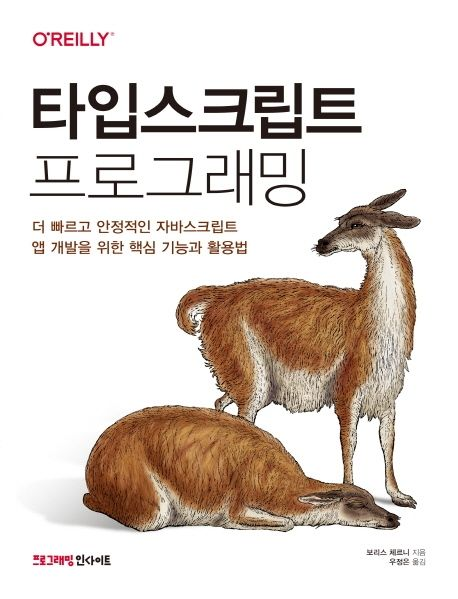

# 타입스크립트 프로그래밍 스터디

> [타입스크립트 프로그래밍 | 보리스 체르니](https://product.kyobobook.co.kr/detail/S000001033092)

## 스터디 일정

- 2025.03.02 ~ now  
- 매 주 화요일 밤 21시

## 진행 방식

- 해당 주차의 범위 읽고 자유 주제 발표 (책 내용 요약, 딥 다이브 등)
- 스터디원 모두 발표 진행
- 책 내 연습문제 답은 스터디 전까지 issue에 작성 후, 스터디에서 토론 

## 업로드 방식

- file
  - 매 주차별 폴더에 `{이름}.md` 작성 
- commit message
  - [타입스크립트 프로그래밍] {n}장 - {챕터명} ({이름})
  - ex) `[타입스크립트 프로그래밍] 3장 - 타입의 모든 것 (현주)`

## 스터디원

| [realzu](https://github.com/realzu) | [nemyung](https://github.com/nemyung) |[codnjs3575](https://github.com/codnjs3575)|
|-------------------------------------|----------------|---|
